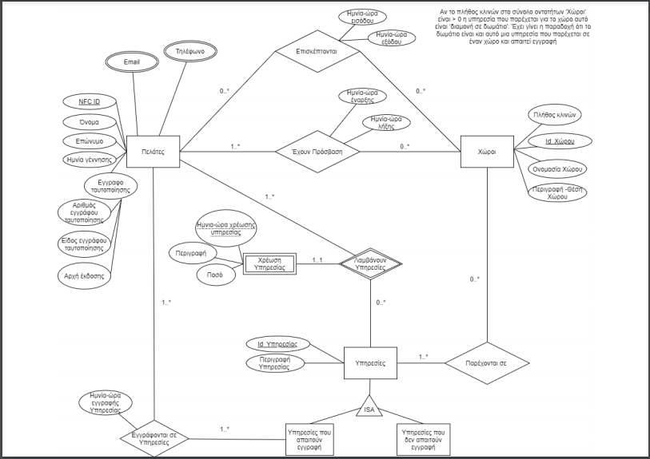
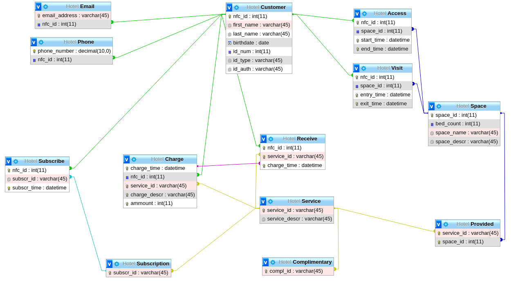

# ASDF-Hotel-Database
Hotel Database Project for the Undergraduate "Databases" Course

#### Project Scenario

A large hotel unit, ASDF Palace, provides hospitality services, managing rooms and restaurants, bars, gyms, meeting rooms, etc. Taking already successful steps in its digital transformation, it has decided, under the threat of the COVID-19 pandemic, to implement further steps for the safety of staff and visitors. The goal is to minimize customer contact with shared switches and handles, doors and elevators, and minimize transactions (by credit or cash) for the use of the hotel services. In case someone from thei hotel's guests is found to be positive, his movements and close contacts can be traced with the help of the hotel's database in order to deal with the most probable cases of transmitions in time and minimize risks as well as the possible effects on the health of employees and visitors.

An NFC-enabled bracelet is delivered to each customer, which provides the user with a unique identity that will serve as a key to all spaces, rooms and services that he wishes to enjoy. The bracelet is the only way for every customer to enter and exit his/her room, as well as to access any area of interest in the hotel, such as lifts, treadmills, restaurants, leisure facilities, bars, work rooms or meeting rooms, gyms, saunas and hair salons as well as the use of services provided in these spaces. The trace of each customer at the entrance and exit from a hotel area is recorded in an information system. At the same time, every time a customer wishes to use a service, the bracelet is read by reader and the corresponding charges are made directly on the customer's tab.

# ER Diagram

# Relational Model

## Project Installation and Deployment Guide (Linux)

1) Clone or download the repository.
2) Start MySQL/MariaDB with the following command: service mysql start
3) Start Apache2 with the following command: service apache2 start
4) Credentials for connecting with the database can be found and changed as needed in the DBConnect.php (best practise is to create a new account in mysql/mariadb using the same credentials, and grant it all privileges for the Hotel Database).
5) Import the Database (Hotel.sql) using the following commands:
     * mysql -u username -p
     * CREATE DATABASE Hotel;
     * mysql -u username -p Hotel < Hotel.sql
3) Move the hotel_web_app to /var/www/html
4) Paste the following path to your Web Browser so that you can access the web application via Apache2: http://127.0.0.1/hotel_web_app/index.html
5) Start querying the Database.

## Project Installation and Deployment Guide (Windows)

1) Clone or download the repository.
2) Start XAMPP and Start Apache and MySQL from the XAMPP Control Panel
3) Open phpMyAdmin
4) In phpMyAdmin, create a new Database named Hotel and import the Hotel.sql file in it. 
5) Credentials for connecting with the database can be found and changed as needed in the DBConnect.php (best practise is to create a new account in phpMyAdmin using the same credentials, and grant it all privileges for the Hotel Database).
6) Move the hotel_web_app to C:\xampp\htdocs (in case of different installation directory, move the hotel_web_app folder inside the htdocs folder inside XAMPP)
7) Access the web application by pasting the following path to your Web Browser: http://localhost/hotel_web_app/index.html
8) Start querying the database.

## Security Warning

This Project was created for learning purposes, being a Semester Assignement for an undergraduate course. Both the web application and the database suffer from major vulnerabilities, like SQLi, remote file inclusion, remote command execution etc (security configuration of the database and web application were outside the scope of the assignement). Do not use this project for real life puproses. After you have finished testing the project, make sure to stop the MySQL and Apache services on your system in order to secure it against open ports that might be exploited by potential attackers.
